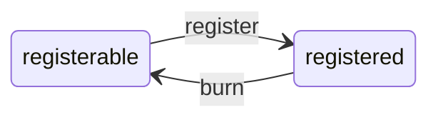

[](https://codecov.io/gh/cyberconnecthq/cyberid)

# cyberid

Id smart contracts for CyberConnect ecosystem. The repo consists of 2 top-level and core smart contracts:

- `CyberId` - the contract that manages the `.cyber` handle of a user
- `RealmId` - the contract that manages the `.moca` handle of a user

## Table of Contents

1. [CyberId](#1-cyberid)
2. [RealmId](#2-realmid)
3. [Development](#3-development)

## 1. CyberId

```
TODO
```

## 2. RealmId

The `RealmId` contract issues `RealmId` for the realmverse network.

A `RealmId` is a **non-transferable** ERC-721 token that represents a unique name like @alice. The mint rule is decided by programmable middleware. After minting, users can set/get arbitrary metadata to/from the token to provide a flexible and transparent mechanism for storing and managing associated information.

### State Machine

- `registerable` - the name can be minted by anyone
- `registered` - the name is registered to an address



The `RealmId` state transitions when users take certain actions:

- `register` - mint a new `RealmId`
- `burn` - burn an owning `RealmId`

### Upgradability

The contract follows the [UUPSUpgradable](https://docs.openzeppelin.com/contracts/4.x/api/proxy#UUPSUpgradeable) design pattern. After deploying, there will be `proxy` and `implementation` contracts deployed. Users only need to interact with the `proxy` contract. The contract owner can upgrade the contract by calling these methods to `proxy` contract:

- `upgradeTo` - Upgrade the implementation of the proxy to a new implementation.
- `upgradeToAndCall` - Upgrade the implementation of the proxy to a new implementation, and subsequently execute the function call encoded in data.

### Metadata

Each `RealmId` has a metadata map attached to it. The metadata map can be set with arbitrary keys and values. The data type of keys and values are `string`. Users or approved operators can

- `batchSetMetadatas` - overwrites metadata kv pairs
- `clearMetadatas` - clears all metadata kv pairs without knowing keys
- `getMetadata` - gets a single metadata kv pair

When a `RealmId` moves from `registered` to `registerable`, `clearMetadatas` is performed for users.

### Middleware

The contract follows a middleware architecture to create more design space for customized logic. Middlewares are plug-and-play custom execution logic code that runs before and after `register`. Developers can customize several rules:

- The `RealmId` pattern (e.g. Only allow 0-9 and lower cases)
- Charge (e.g. Free or requires erc20 tokens based on `RealmId` length)
- Permission (e.g. Only Signer or anyone can `register`)
- …

### Permission

The contract defines one owner address that has permission to operate:

- `setMiddleware` - overwrites middleware of the contract
- `upgradeTo` - Upgrade the implementation of the proxy to a new implementation.
- `upgradeToAndCall` - Upgrade the implementation of the proxy to a new implementation, and subsequently execute the function call encoded in data.
- `setBaseTokenUri` - overwrites base token URI of the contract

## 3. Development

### Develop Contracts

0. Upgrade your foundry

   `foundryup`

1. To enable husky pre-commit

   `yarn && yarn prepare`

2. To install contract dependencies

   `forge install`

3. To build

   `forge build`

4. To test

   `forge test -vvv`

5. (optional) To run static analysis

   `slither .`

### Deploy Contracts

We use [Create2Deployer](./src/deployer/Create2Deployer.sol) to ensure proxy contracts are deployed deterministically. Take Deploying `RealmId` on Polygon testnet(mumbai) as an example, the deployment process is:

0. Step 1-3 is one-time work. Go to step 4 if you have done it once.

1. Prepare a brand new EOA for deployment because the nonce of the EOA will influence the deployer address. The nonce should be 0 across chains.

2. Prepare `.env.mumbai` at the repo root directory. The `ETHERSCAN_API_KEY` for mumbai can be obtained from [here](https://docs.polygonscan.com/v/mumbai-polygonscan/).

   ```bash
   RPC_URL=<mumbai RPC>
   PRIVATE_KEY=<your deployer EOA private key>
   ETHERSCAN_API_KEY=<your polygon testnet scan API key>
   ```

3. Deploy `Create2Deployer` and collect its address

   `yarn deploy_deployer:mumbai`

4. Update the `deployerContract` in the `MUMBAI` block in [DeploySetting.sol](./script/libraries/DeploySetting.sol)

5. Deploy `RealmId`

   `yarn deploy_realmid:mumbai`

Finally, you can write your yarn entry points in [package.json] to customize and repeat your deployment process.
